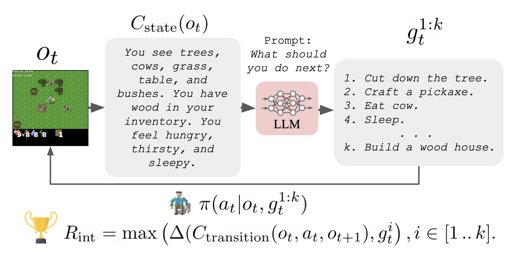

# Guiding Pretraining in Reinforcement Learning with Large Language Models

This is the codebase for the paper [Guiding Pretraining in Reinforcement Learning with Large Language Models (ICML 2023)](https://arxiv.org/pdf/2302.06692.pdf).




## Installation Instructions

### Crafter (Hafner, 2021)
For Crafter, run
```
conda env create -f conda_env.yml
conda activate text-crafter
```

### Housekeep (Kant et al., 2022)
For [Housekeep](https://github.com/yashkant/housekeep), follow this set of adapted installation instructions: 
```
conda create -n ellm-housekeep python=3.8
conda activate ellm-housekeep 
conda install habitat-sim==0.2.1 withbullet headless -c conda-forge -c aihabitat
cd text_housekeep/habitat_lab
pip install -r requirements.txt
python setup.py develop --all
```

Then run `conda env update -f conda_env_housekeep.yml` to install additional ELLM dependencies. If you get an error about `llvm-lite`, use `pip install llvmlite==0.38.0 --ignore-installed`.

Then download the data following the instructions [here](https://github.com/yashkant/housekeep/blob/master/data/README.md). Everything should be downloaded under `text_housekeep/data`.

If you get an error
``` 
File "/YOUR_MINICONDA_DIR/envs/ellm-housekeep/lib/python3.8/site-packages/habitat_sim/agent/controls/default_controls.py", line 47, in _rotate_local
    raise RuntimeError(
RuntimeError: Constrained look only works for a singular look action type
```

Go to `/YOUR_MINICONDA_DIR/envs/ellm-housekeep/lib/python3.8/site-packages/habitat_sim/agent/controls/default_controls.py` and change line 47 `if mn.math.angle(ref_vector, mn.Vector3(np.abs(rotation.axis().normalized()))) > mn.Rad(1e-3):` to `if mn.math.angle(ref_vector, mn.Vector3(np.abs(rotation.axis().normalized()))) > mn.Rad(1e-3):`


### Update environment variables

If you haven't already, sign up for an OpenAI account.

Add this to your .bashrc:

```
export OPENAI_API_KEY=GET_YOUR_API_KEY_FROM_THEIR_WEBSITE
```

## Configs

To train the agent:

```
python train.py
```

All default configurations are found in `config.yaml`. For environment-specific hyperparameter changes, see Appendix G in the [paper](https://arxiv.org/pdf/2302.06692.pdf). Some important ones are:

<ins>To use text observations (in addition to pixel observations, which is the default):</ins>
`--env_spec.use_sbert` - set to True to use SBERT encodings for text observations.
`--use_language_state=sbert` - set `sbert` to train with text observations as well as pixel observations (pixels only is the default).

<ins>To use goal conditioning:</ins>
`--use_goal` - set to True to condition the agent policy on a language string of the goal.
`--agent.goal_encoder_type=sbert` - set `sbert` to encode goals using a SBERT model.

<ins>To run the oracle:</ins>
`--env_spec.lm_spec.lm_class=SimpleOracle`

<ins>To run with GPT:</ins>
`--env_spec.lm_spec.lm_class=GPTLanguageModel --env_spec.threshold=.99 env_spec.lm_spec.temperature=0.1 env_spec.lm_spec.openai_key=YOUR_API_KEY`

<ins>To run with intrinsic objective baselines:</ins>
`--agent._target_=baselines.icm_apt.ICMAPTAgent` for APT
`--agent._target_=baselines.rnd.RNDAgent` for RND
Note: to add in additonal arguments for the baseline agents, you can add arguments `+agent.use_language=True` or `+agent.noveld=True`

<ins>Monitor results:</ins>
You can set `--use_tb=True` to log to tensorboard. Then run TB:
`sh tensorboard --logdir exp_local`
Alternatively, set `--use_wandb=True` to log to wandb.

<ins>Housekeep Episodes:</ins>
You can set `--env_spec.housekeep_ep_num` to choose between episodes with different object and receptable configurations. The paper reports results for 2, 8, 12, and 14.

## Example Commands
(These commands match the configurations used in our paper).

#### Pretraining Crafter agent trained with oracle reward, (goal-conditioned, use language state)
`python train.py env_spec.use_sbert=True use_goal=True use_language_state=sbert env_spec.lm_spec.lm_class=SimpleOracle exp_name=TEST_RUN`

#### Pretraining Crafter agent trained with ELLM reward, (goal-conditioned, use language state)
`python train.py env_spec.use_sbert=True use_goal=True use_language_state=sbert env_spec.lm_spec.lm_class=GPTLanguageModel env_spec.lm_spec.openai_key=YOUR_KEY exp_name=TEST_RUN`

#### Guiding exploration with pretrained Crafter agent (plus finetuning with oracle task rewards)
`python train.py single_goal_eval=True use_language_state=sbert env_spec.use_sbert=True use_goal=True env_spec.lm_spec.lm_class=SimpleOracle train_after_reward=True decay_after_reward=True env_spec.single_task="finetuning task name" expl_agent_path=/path/to/pretrained/agent num_train_frames=2000000 exp_name=TEST_RUN`

(Example finetuning task: "attack cow")

(Variant: for finetuning tasks where the agent should see subgoals (but still only get rewarded for full completion),
set `env_spec.single_goal_hierarchical=reward_last use_goal=True`).

#### Finetuning pretrained Crafter agent with oracle rewards
`python train.py single_goal_eval=True use_language_state=sbert env_spec.use_sbert=True use_goal=True env_spec.lm_spec.lm_class=SimpleOracle train_after_reward=True decay_after_reward=True finetune_snapshot=True agent.train_eps_max=.5 lr=0.00002 env_spec.single_task="finetuning task name" snapshot_path=/path/to/pretrained/agent num_train_frames=1000000 exp_name=TEST_RUN`

(Example finetuning task: "attack cow")

#### Pretraining Housekeep agent trained with ELLM reward, not goal-conditioned, yes language state
`python train.py env_spec.use_sbert=True use_language_state=sbert env_spec.use_language_state=True env_spec.lm_spec.lm_class=GPTLanguageModel env_spec.lm_spec.lm=text-davinci-002 env_spec.lm_spec.budget=10 env_spec.lm_spec.temperature=0 env_spec.lm_spec.prob_threshold=.5 env_spec.name=Housekeep use_wandb=true num_train_frames=4000000 replay_buffer_num_workers=5 batch_size=256 agent.train_eps_min=0.1 agent.train_eps_decay_steps=5000000 exp_name=TEST_RUN env_spec.housekeep_ep_num=2`

#### Finetuning pretrained Housekeep agent with oracle rewards
`python train.py env_spec.use_sbert=True use_language_state=sbert env_spec.use_language_state=True env_spec.lm_spec.lm_class=SimpleOracle finetune_snapshot=True snapshot_path=ADD_PATH_TO_PRETRAINED_MODEL_HERE  env_spec.name=Housekeep use_wandb=true num_train_frames=5000000 replay_buffer_num_workers=5  batch_size=256 agent.train_eps_min=0.1 agent.train_eps_decay_steps=5000000 exp_name=FINETUNE_RUN env_spec.housekeep_ep_num=2`

#### Guiding exploration with pretrained Housekeep agent
`python train.py env_spec.use_sbert=True use_language_state=sbert env_spec.use_language_state=True env_spec.lm_spec.lm_class=SimpleOracle finetune_snapshot=True  env_spec.name=Housekeep use_wandb=true num_train_frames=5000000 replay_buffer_num_workers=5  batch_size=256 agent.train_eps_min=0.2 agent.train_eps_decay_steps=1000000 exp_name=EXPL_RUN  env_spec.housekeep_ep_num=2 expl_agent_path=ADD_PATH_TO_PRETRAINED_MODEL_HERE`

## Pretrained Captioner
Download these to the project directory if you want to run with learned captioners.

(Not recommended for most experiments, since they slow things down significantly and degrade performance).

[Transition captioner weights](https://drive.google.com/file/d/116JSUxPQIcZErQ4cBvusF547gGGZKWbC/view?usp=sharing)
[State captioner weights](https://drive.google.com/file/d/1Qq9x75eIKKnZAbDA_4D6o_Xyamyi6VjP/view?usp=sharing)